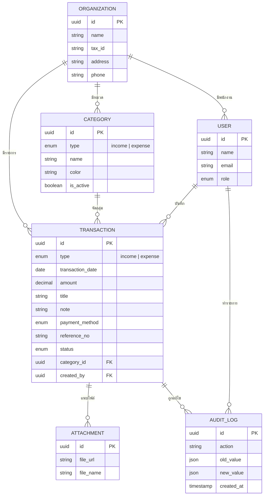

# Database Design — ระบบบันทึกรายรับ-รายจ่าย

> แทนเสมียนที่จดสมุดรายรับ-รายจ่ายด้วยมือ  
> **ไม่ใช่ POS ร้านอาหาร** — เก็บแค่รายรับ-รายจ่ายและสิ่งที่ช่วยค้นหา/สรุป/ตรวจสอบ

---
## 🧠 ความจำกลาง (Central Memory)

> **กฎการใช้ความจำ:**
> 1. ทุกครั้งที่เริ่มงานหรือเริ่มแชทใหม่ **ต้องอ่านไฟล์นี้ก่อนเสมอ**
> 2. เมื่อมีการปรับแก้ไขหรือแก้บัค **ต้องจดบันทึกลงส่วนนี้ทุกครั้ง**
> 3. หลังจากบันทึกเสร็จ **ต้องอ่านไฟล์นี้อีกครั้งเพื่อยืนยันว่าจดครบ**
> 4. ต้องรายงานสถานะ: ทำอะไรแล้ว / แก้อะไร / อัปเดทส่วนใด / สถานะปัจจุบัน

### สถานะปัจจุบัน

| ส่วนงาน | สถานะ |
|---------|--------|
| Tech Stack สำหรับ Database | ✅ **Supabase (PostgreSQL)** |
| ไม่สร้าง receipts collection แยก | ✅ เก็บ `receipt_no` + `is_printed` ใน `transactions` |
| `settings` รวมใน `organizations` | ✅ `receipt_config` + `hardware_config` (object) |
| จำนวนผู้ใช้ MVP | ✅ 1 คน (role=`admin` default) |
| Schema Supabase จริง | ✅ อัปเดท types + services + API routes |
| Seed Data | ✅ เขียน seed script (`src/scripts/seed.ts`) รอ env vars |
| API CRUD | ✅ transactions, categories, organizations, users, **cash_counts** |
| Table `cash_counts` | ✅ นับเงินสดประจำวัน (openingBalance, expected, actual, variance, status) |
| Row Level Security / Policies | ⏳ ยังไม่ทำ |
| Build + Lint | ✅ ผ่าน |
| Frontend compatibility | ✅ คง `Receipt` type ไว้สำหรับ UI |

### Checklist งาน

#### ✅ เสร็จแล้ว (Done)
- [x] ตัดสินใจ Tech Stack: **Supabase (PostgreSQL)** + Node.js + Next.js + React + Tailwind CSS
- [x] ออกแบบโครงสร้าง Tables: users, organizations, categories, transactions, cash_counts
- [x] ยืนยันไม่สร้าง receipts table แยก (เก็บใน transactions)
- [x] ยืนยัน settings รวมใน organizations (receipt_config, hardware_config)
- [x] กำหนด fields สำหรับ users (MVP 1 คน)
- [x] ติดตั้ง `@supabase/supabase-js` (ลบ Firebase ออก)
- [x] เขียน `src/lib/db/supabase.ts` (initialize client)
- [x] อัปเดท `src/types/index.ts` ให้ตรงกับ Supabase schema
- [x] สร้าง services CRUD: organizations, users, categories, transactions, cash_counts
- [x] สร้าง API Routes: `/api/organizations`, `/api/users`, `/api/categories`, `/api/transactions`, `/api/cash-counts`
- [x] อัปเดท `/api/reports/summary` ให้ query จาก Supabase
- [x] สร้าง `cash_counts` service: CRUD + คำนวณ `expectedBalance` จาก transactions real-time
- [x] สร้าง seed script (`src/scripts/seed.ts`) สำหรับ Supabase
- [x] สร้าง SQL Schema (`docs/supabase-schema.sql`) — CREATE TABLE + Constraints + Index + RLS
- [x] อัปเดท mock data ให้เป็นข้อมูลธุรกิจทั่วไป (ไม่ใช่ร้านกาแฟ)
- [x] อัปเดท constants: payment methods ให้ตรงกับ design (cash, transfer, cheque, card, other)
- [x] ผ่าน `npm run build`
- [x] ผ่าน `npm run lint`

#### 🔄 กำลังทำ (In Progress)
- [ ] รอคำสั่งต่อไปจากคุณ

#### ⏳ ยังไม่ทำ (Pending)
- [ ] สร้าง Supabase Project / สร้าง Tables จริง (ต้องมี env vars)
- [ ] รัน seed script กับ Supabase จริง
- [ ] ตั้งค่า Row Level Security + Policies
- [ ] เชื่อม API กับ Frontend (ตอนนี้ API ใช้ Supabase services แล้ว)
- [ ] ทดสอบ end-to-end กับ Supabase จริง

### 📝 บันทึกการแก้ไข (Change Log)

| วันที่ | เรื่อง | รายละเอียด | ผู้บันทึก |
|--------|--------|------------|----------|
| 2026-06-07 | สร้างความจำกลาง | เพิ่มส่วน Central Memory + Checklist ในไฟล์นี้ | Devin |
| 2026-06-07 | ตัดสินใจ Tech Stack | ใช้ Firebase (Firestore) แทน PostgreSQL | Devin |
| 2026-06-07 | ยืนยัน Schema | receipts ไม่ต้องสร้าง collection แยก, settings รวมใน organizations | Devin |
| 2026-06-07 | Implement Firestore Backend | ติดตั้ง Firebase SDK, สร้าง services + API routes + seed script, อัปเดท types + mock data + constants | Devin |
| 2026-06-07 | Fix build errors | เพิ่ม `Receipt` type คืนเพื่อ backward compatibility กับ UI, แก้ Query type ใน services | Devin |
| 2026-06-07 | Fix lint warnings | ลบ unused imports ใน organizations route และ services | Devin |
| 2026-06-07 | เพิ่ม `cash_counts` collection | สร้าง service + API route สำหรับการนับเงินสดประจำวัน (openingBalance, expected, actual, variance, status) คำนวณ expectedBalance จาก transactions real-time | Devin |
| 2026-06-07 | **เปลี่ยน Database เป็น Supabase** | ลบ Firebase + Firestore ออก ติดตั้ง `@supabase/supabase-js` แก้ services ทั้งหมดใช้ Supabase client (`.from().select().insert()`) แก้ seed script, ลบ `firebase.ts`, build + lint ผ่าน | Devin |
| 2026-06-07 | สร้าง SQL Schema | เขียน `docs/supabase-schema.sql` — CREATE TABLE 5 ตาราง (organizations, users, categories, transactions, cash_counts) + Constraints + Index + RLS Policies | Devin |
| 2026-06-07 | Rename services folder | เปลี่ยนชื่อ `src/lib/services/firestore/` → `src/lib/services/db/` + อัปเดท imports ทุกไฟล์ | Devin |

---
## สรุปสั้น — เก็บ 5 กลุ่มหลัก

| กลุ่ม | เก็บอะไร | ทำไมต้องเก็บ |
|------|---------|-------------|
| **1. รายการเงิน** | รายรับ + รายจ่าย ทุกบรรทัด | หัวใจของระบบ — แทนบรรทัดในสมุด |
| **2. หมวดหมู่** | ประเภทรายรับ/รายจ่าย | จัดกลุ่มให้ดูรายงานได้ เช่น ค่าเช่า, เงินเดือน, รายได้จากลูกค้า A |
| **3. ข้อมูลองค์กร** | ชื่อบริษัท, ที่อยู่, เลขภาษี | ใส่หัวรายงาน / export |
| **4. ผู้ใช้ + ประวัติ** | ใครจด, ใครแก้, เมื่อไหร่ | ตรวจสอบย้อนหลังได้ (audit) |
| **5. เอกสารแนบ (ถ้ามี)** | สลิปโอน, ใบเสร็จสкан | อ้างอิงได้เหมือนเสมียนแปะใบเสร็จในสมุด |

### ไม่ต้องเก็บ

- สินค้า, ราคาเมนู, โต๊ะ, ออเดอร์
- Inventory / สต็อก
- Thermal printer, cash drawer
- Receipt สำหรับพิมพ์หน้าร้าน (POS)

---

## ภาพรวมความสัมพันธ์ (ER)



---

## ตารางที่ 1: `transactions` — รายรับ / รายจ่าย

ตารางนี้คือ **สมุดบัญชีทั้งเล่ม** เก็บรวมทั้งรายรับและรายจ่ายในตารางเดียว แยกด้วย `type`

| Field | ชนิดข้อมูล | บังคับ | ความหมาย | ตัวอย่าง |
|-------|-----------|--------|----------|---------|
| `id` | UUID | ✅ | รหัสไม่ซ้ำ | `txn-a1b2c3...` |
| `organization_id` | UUID FK | ✅ | องค์กร/บริษัท | — |
| `type` | enum | ✅ | `income` = รายรับ, `expense` = รายจ่าย | `expense` |
| **`transaction_date`** | date | ✅ | **วันที่เกิดรายการจริง** (วันที่ในสมุด) | `2026-06-05` |
| `amount` | decimal(12,2) | ✅ | จำนวนเงิน (บาท) ต้อง > 0 | `3500.00` |
| `title` | varchar(200) | ✅ | ชื่อรายการ / คำอธิบายสั้น | `ค่าไฟเดือนมิ.ย.` |
| `category_id` | UUID FK | ✅ | หมวดหมู่ | → ค่าน้ำ-ค่าไฟ |
| `payment_method` | enum | ✅ | ช่องทางเงิน | `transfer` |
| `note` | text | ❌ | หมายเหตุเพิ่ม | `โอนจากบัญชีกสิกร บช.xxx` |
| `reference_no` | varchar(100) | ❌ | เลขที่อ้างอิงเอกสาร | `INV-2026-0042` |
| `status` | enum | ✅ | สถานะรายการ | `active`, `void` |
| `void_reason` | text | ❌ | เหตุผลที่ยกเลิก | `จดซ้ำ` |
| `voided_at` | timestamp | ❌ | วันเวลาที่ยกเลิก | — |
| `voided_by` | UUID FK | ❌ | ใครยกเลิก | — |
| `created_by` | UUID FK | ✅ | ใครเป็นคนจด | `user-001` |
| `created_at` | timestamp | ✅ | วันเวลาที่บันทึกเข้าระบบ | `2026-06-06T09:30:00Z` |
| `updated_by` | UUID FK | ❌ | ใครแก้ล่าสุด | — |
| `updated_at` | timestamp | ❌ | วันเวลาแก้ล่าสุด | — |

### ค่า `payment_method`

| ค่า | ความหมาย |
|-----|----------|
| `cash` | เงินสด |
| `transfer` | โอนเงิน |
| `cheque` | เช็ค |
| `card` | บัตรเครดิต/เดบิต |
| `other` | อื่นๆ |

### ทำไม `transaction_date` สำคัญกว่า `created_at`

| Field | ความหมาย |
|-------|----------|
| `transaction_date` | วันที่ **เกิดรายการจริง** (เช่น จ่ายค่าไฟวันที่ 1 มิ.ย.) |
| `created_at` | วันที่ **พิมพ์ลงระบบ** (เช่น จดย้อนหลังวันที่ 6 มิ.ย.) |

รายงานรายเดือนต้องอิง **`transaction_date`** ไม่ใช่วันที่กดบันทึก

### ตัวอย่างข้อมูล

| วันที่ | ประเภท | รายการ | จำนวน | หมวด | ช่องทาง | หมายเหตุ |
|--------|--------|--------|-------|------|---------|----------|
| 2026-06-01 | รายจ่าย | ค่าเช่าสำนักงาน | 15,000 | ค่าเช่า | โอน | โอนเจ้าของอาคาร |
| 2026-06-03 | รายรับ | รับชำระลูกค้า A | 25,000 | รายได้ขาย | โอน | ใบแจ้งหนี้ INV-0042 |
| 2026-06-05 | รายจ่าย | ซื้อเครื่องเขียน | 890 | วัสดุส office | เงินสด | ใบเสร็จ 7-11 |
| 2026-06-06 | รายรับ | รับเงินสดย่อย | 3,500 | รายได้อื่น | เงินสด | — |

---

## ตารางที่ 2: `categories` — หมวดหมู่

| Field | ชนิด | บังคับ | ความหมาย | ตัวอย่าง |
|-------|------|--------|----------|---------|
| `id` | UUID | ✅ | รหัส | `cat-001` |
| `organization_id` | UUID FK | ✅ | องค์กร | — |
| `type` | enum | ✅ | `income` หรือ `expense` | `expense` |
| `name` | varchar(100) | ✅ | ชื่อหมวด | `ค่าเช่า` |
| `color` | varchar(7) | ❌ | สีในกราฟ/UI | `#B22222` |
| `sort_order` | int | ❌ | ลำดับแสดงผล | `10` |
| `is_active` | boolean | ✅ | ใช้งานอยู่หรือไม่ | `true` |
| `created_at` | timestamp | ✅ | วันที่สร้าง | — |

**Constraint:** หมวดรายรับกับรายจ่ายแยกกัน — ห้ามใช้หมวดรายรับกับรายจ่าย

### หมวดรายจ่ายที่ธุรกิจทั่วไปมักใช้

- ค่าเช่า / ค่าน้ำ-ค่าไฟ / ค่าโทรศัพท์-อินเทอร์เน็ต
- เงินเดือน / ค่าจ้าง / ประกันสังคม
- วัสดุส office / ค่าเดินทาง / ค่าโฆษณา
- ภาษี / ดอกเบี้ย / ค่าธรรมเนียมธนาคาร
- อื่นๆ

### หมวดรายรับที่ธุรกิจทั่วไปมักใช้

- รายได้จากการขาย / รายได้บริการ
- รายได้ดอกเบี้ย / รายได้อื่น
- เงินคืน / เงินรับล่วงหน้า (ถ้าต้องการ)

---

## ตารางที่ 3: `organizations` — ข้อมูลบริษัท/หน่วยงาน

| Field | ชนิด | บังคับ | ความหมาย | ตัวอย่าง |
|-------|------|--------|----------|---------|
| `id` | UUID | ✅ | รหัส | — |
| `name` | varchar(200) | ✅ | ชื่อบริษัท/ร้าน | `บจก. ABC จำกัด` |
| `tax_id` | varchar(20) | ❌ | เลขประจำตัวผู้เสียภาษี | `0-1234-56789-01-2` |
| `address` | text | ❌ | ที่อยู่ | ใส่หัวรายงาน |
| `phone` | varchar(20) | ❌ | เบอร์โทร | `02-xxx-xxxx` |
| `currency` | varchar(3) | ✅ | สกุลเงิน | `THB` |
| `fiscal_year_start_month` | int | ❌ | เดือนเริ่มปีบัญชี | `1` (ม.ค.) หรือ `10` (ต.ค.) |
| `created_at` | timestamp | ✅ | — | — |

> ถ้ามีแค่ 1 บริษัท ตารางนี้มี **1 แถว** — ใช้ใส่หัว PDF/Excel รายงาน

---

## ตารางที่ 4: `users` — ผู้ใช้งาน

| Field | ชนิด | บังคับ | ความหมาย |
|-------|------|--------|----------|
| `id` | UUID | ✅ | รหัส |
| `organization_id` | UUID FK | ✅ | สังกัด |
| `name` | varchar(100) | ✅ | ชื่อที่แสดง |
| `email` | varchar(255) | ✅ | ใช้ login |
| `password_hash` | varchar | ✅ | รหัสผ่าน (hash) |
| `role` | enum | ✅ | `admin` = ดู/แก้/ลบได้, `staff` = จดได้อย่างเดียว |
| `is_active` | boolean | ✅ | ยังใช้งานอยู่ |
| `last_login_at` | timestamp | ❌ | login ล่าสุด |
| `created_at` | timestamp | ✅ | — |

---

## ตารางที่ 5: `attachments` — ไฟล์แนบ (Phase 2)

| Field | ชนิด | บังคับ | ความหมาย |
|-------|------|--------|----------|
| `id` | UUID | ✅ | รหัส |
| `transaction_id` | UUID FK | ✅ | ผูกกับรายการไหน |
| `file_name` | varchar(255) | ✅ | ชื่อไฟล์เดิม |
| `file_url` | text | ✅ | path ใน S3/Supabase Storage |
| `file_type` | varchar(50) | ❌ | `image/jpeg`, `application/pdf` |
| `file_size` | int | ❌ | ขนาด bytes |
| `uploaded_by` | UUID FK | ✅ | ใครอัปโหลด |
| `uploaded_at` | timestamp | ✅ | เมื่อไหร่ |

---

## ตารางที่ 6: `audit_logs` — ประวัติการแก้ไข

| Field | ชนิด | บังคับ | ความหมาย |
|-------|------|--------|----------|
| `id` | UUID | ✅ | รหัส |
| `organization_id` | UUID FK | ✅ | — |
| `user_id` | UUID FK | ✅ | ใครทำ |
| `entity_type` | varchar(50) | ✅ | `transaction`, `category` |
| `entity_id` | UUID | ✅ | รหัส record ที่ถูกแก้ |
| `action` | enum | ✅ | `create`, `update`, `void`, `delete` |
| `old_value` | jsonb | ❌ | ค่าก่อนแก้ |
| `new_value` | jsonb | ❌ | ค่าหลังแก้ |
| `created_at` | timestamp | ✅ | เวลา |

**ตัวอย่าง:** แก้จำนวนเงินจาก 3,500 → 3,800 ระบบเก็บทั้งค่าเก่าและใหม่ + ใครแก้ + เมื่อไหร่

---

## สิ่งที่ไม่ต้องเก็บใน DB

| สิ่งที่โค้ดปัจจุบันมี | ทำไมไม่ต้องเก็บ |
|---------------------|----------------|
| `Receipt` (เลขใบเสร็จพิมพ์) | ไม่ใช่ POS — ไม่พิมพ์ใบเสร็จหน้าร้าน |
| `/lib/hardware/printer` | ไม่มีเครื่องพิมพ์ thermal |
| `/lib/hardware/cashDrawer` | ไม่มีลิ้นชัก |
| Mock "ลาเต้ร้อน", "ครัวซองต์" | เป็นข้อมูลร้านกาแฟ — ควรเปลี่ยนเป็นตัวอย่างบัญชีทั่วไป |
| `ReportSummary` เป็นตาราง | **คำนวณจาก transactions** ไม่ต้องเก็บแยก |
| `DashboardSummary` | คำนวณ real-time จาก query |
| สินค้า / เมนู / สต็อก | ไม่ใช่ inventory system |
| ลูกค้า POS / โต๊ะ / ออเดอร์ | ไม่ใช่ร้านอาหาร |

---

## โค้ดปัจจุบัน vs ควรเก็บจริง

### มีอยู่แล้ว (`src/types/index.ts`)

```typescript
interface Transaction {
  id: string;
  type: TransactionType;       // income | expense
  categoryId: string;
  title: string;
  amount: number;
  note?: string;
  createdAt: string;           // ⚠️ ควรแยก transaction_date
  paymentMethod: PaymentMethod;
}

interface Category {
  id: string;
  name: string;
  type: TransactionType;
  color: string;
}
```

### ยังขาด (ควรเพิ่มใน DB จริง)

| Field | ความสำคัญ | เหตุผล |
|-------|-----------|--------|
| `transaction_date` | ⭐⭐⭐ | รายงานรายเดือนต้องใช้ |
| `reference_no` | ⭐⭐ | เลขใบแจ้งหนี้/สลิป |
| `status` / `void_*` | ⭐⭐⭐ | ยกเลิกรายการโดยไม่ลบ (audit) |
| `created_by` / `updated_by` | ⭐⭐ | รู้ว่าใครจด/แก้ |
| `organization_id` | ⭐ | รองรับหลายบริษัทในอนาคต |
| `attachments` | ⭐ | แนบสลิป (phase 2) |

---

## รายงานที่คำนวณจาก DB (ไม่ต้องเก็บเป็นตาราง)

| รายงาน | Query |
|--------|-------|
| รายรับวันนี้ | `SUM(amount) WHERE type=income AND transaction_date=วันนี้` |
| รายจ่ายเดือนนี้ | `SUM(amount) WHERE type=expense AND transaction_date ในเดือน` |
| กำไรสุทธิ | รายรับรวม − รายจ่ายรวม |
| กราฟรายวัน | `GROUP BY transaction_date` |
| สรุปตามหมวด | `GROUP BY category_id` |
| รายการล่าสุด | `ORDER BY transaction_date DESC, created_at DESC LIMIT 10` |

---

## MVP vs Phase 2

### MVP (รอบแรก — แทนเสมียนได้เลย)

| ตาราง | สถานะ |
|-------|--------|
| `transactions` | ✅ ต้องมี — ครบ field หลัก + `transaction_date` + `status` |
| `categories` | ✅ ต้องมี — CRUD หมวด |
| `organizations` | ✅ ต้องมี — ชื่อบริษัท 1 แถว |
| `users` | ⚠️ ถ้ามีแค่ 1 คน อาจข้าม auth ก่อน |
| `attachments` | ❌ Phase 2 |
| `audit_logs` | ❌ Phase 2 (แต่ควรมีถ้ามีหลายคนใช้) |

### Phase 2

- แนบไฟล์สลิป
- Export PDF / Excel
- ปิดงวดบัญชีรายเดือน (lock รายการเก่า)
- ยอดยกมา (opening balance) ต้นเดือน/ต้นปี
- หลายผู้ใช้ + role

---

## SQL Schema ตัวอย่าง (PostgreSQL)

```sql
-- องค์กร
CREATE TABLE organizations (
  id UUID PRIMARY KEY DEFAULT gen_random_uuid(),
  name VARCHAR(200) NOT NULL,
  tax_id VARCHAR(20),
  address TEXT,
  phone VARCHAR(20),
  currency VARCHAR(3) NOT NULL DEFAULT 'THB',
  fiscal_year_start_month INT DEFAULT 1,
  created_at TIMESTAMPTZ NOT NULL DEFAULT NOW()
);

-- หมวดหมู่
CREATE TABLE categories (
  id UUID PRIMARY KEY DEFAULT gen_random_uuid(),
  organization_id UUID NOT NULL REFERENCES organizations(id),
  type VARCHAR(10) NOT NULL CHECK (type IN ('income', 'expense')),
  name VARCHAR(100) NOT NULL,
  color VARCHAR(7),
  sort_order INT DEFAULT 0,
  is_active BOOLEAN NOT NULL DEFAULT TRUE,
  created_at TIMESTAMPTZ NOT NULL DEFAULT NOW(),
  UNIQUE (organization_id, type, name)
);

-- รายรับ-รายจ่าย (หัวใจ)
CREATE TABLE transactions (
  id UUID PRIMARY KEY DEFAULT gen_random_uuid(),
  organization_id UUID NOT NULL REFERENCES organizations(id),
  type VARCHAR(10) NOT NULL CHECK (type IN ('income', 'expense')),
  transaction_date DATE NOT NULL,
  amount DECIMAL(12,2) NOT NULL CHECK (amount > 0),
  title VARCHAR(200) NOT NULL,
  category_id UUID NOT NULL REFERENCES categories(id),
  payment_method VARCHAR(20) NOT NULL
    CHECK (payment_method IN ('cash','transfer','cheque','card','other')),
  note TEXT,
  reference_no VARCHAR(100),
  status VARCHAR(10) NOT NULL DEFAULT 'active'
    CHECK (status IN ('active','void')),
  void_reason TEXT,
  voided_at TIMESTAMPTZ,
  voided_by UUID,
  created_by UUID,
  created_at TIMESTAMPTZ NOT NULL DEFAULT NOW(),
  updated_by UUID,
  updated_at TIMESTAMPTZ
);

-- Index สำหรับรายงาน
CREATE INDEX idx_txn_date ON transactions (organization_id, transaction_date);
CREATE INDEX idx_txn_type_date ON transactions (organization_id, type, transaction_date);
CREATE INDEX idx_txn_category ON transactions (category_id);
CREATE INDEX idx_txn_status ON transactions (organization_id, status);
```

---

## สรุปสุดท้าย

**เก็บ 3 อย่างหลัก:**

1. **ทุกบรรทัดรายรับ-รายจ่าย** — วันที่, จำนวนเงิน, รายการ, หมวด, ช่องทางเงิน, หมายเหตุ, เลขอ้างอิง
2. **หมวดหมู่** — จัดกลุ่มรายรับ/รายจ่าย
3. **ข้อมูลบริษัท + ผู้ใช้** — ใส่หัวรายงาน + รู้ว่าใครจด

**Dashboard, กราฟ, สรุปเดือน = คำนวณจาก query ไม่ต้องเก็บ**

**ไม่เก็บ:** POS, เมนู, ออเดอร์, สต็อก, เครื่องพิมพ์, ลิ้นชัก
