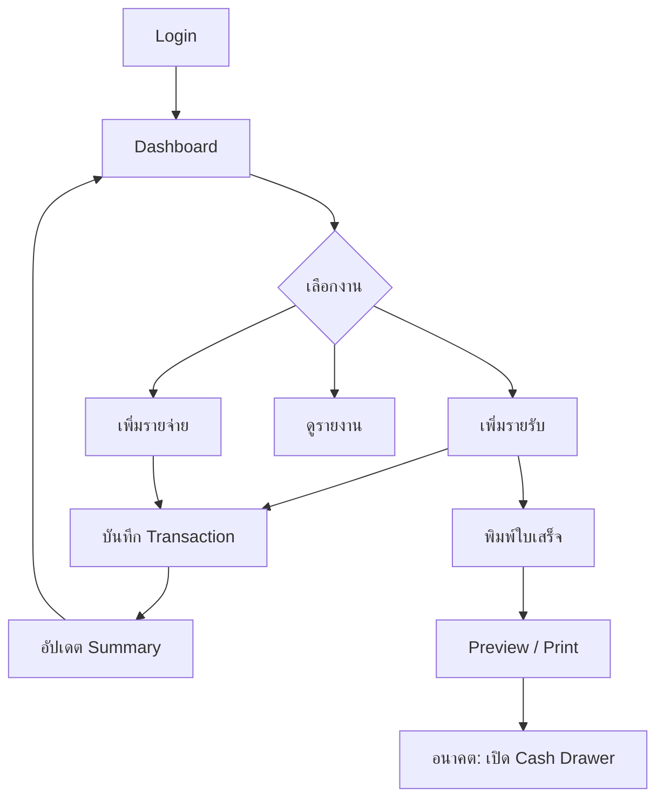

# User Workflow

## ภาพรวมการใช้งานระบบ

```
Login → Dashboard → เพิ่มรายรับ/รายจ่าย → บันทึก → อัปเดตสรุป → พิมพ์ใบเสร็จ → (อนาคต) เปิดลิ้นชัก
```

## ขั้นตอนการใช้งาน

### 1. Login

- พนักงานเปิด Web App
- กรอกอีเมลและรหัสผ่าน
- เข้าสู่ระบบ (รอบแรกใช้ Mock — กดปุ่มเข้า Dashboard ได้เลย)

### 2. เข้า Dashboard

- ดูสรุปยอดรายรับ-รายจ่ายวันนี้
- ดูกำไรสุทธิเดือนนี้
- ดูรายการล่าสุดและกราฟ

### 3. เพิ่มรายรับหรือรายจ่าย

**รายรับ**

1. ไปที่เมนู "รายรับ" → "เพิ่มรายรับ"
2. กรอก: หมวดหมู่, รายการ, จำนวนเงิน, ช่องทางชำระเงิน, หมายเหตุ
3. กดบันทึก

**รายจ่าย**

1. ไปที่เมนู "รายจ่าย" → "เพิ่มรายจ่าย"
2. กรอกข้อมูลเช่นเดียวกับรายรับ
3. กดบันทึก

### 4. ระบบบันทึกข้อมูล

- ข้อมูลถูกส่งไป API (`POST /api/transactions`)
- บันทึกลง database (อนาคต — ปัจจุบันใช้ mock in-memory)

### 5. ระบบอัปเดตยอดสรุป

- Dashboard คำนวณยอดรวมใหม่
- หน้ารายงานอัปเดตกราฟและสรุป

### 6. พิมพ์ใบเสร็จ

- จากรายการรายรับ กด "พิมพ์ใบเสร็จ"
- ระบบแสดง preview จาก template
- (อนาคต) ส่งคำสั่ง ESC/POS ไป Thermal Printer

### 7. ในอนาคต — สั่งลิ้นชักเด้ง

- เมื่อรับเงินสด ระบบส่ง pulse command ผ่าน printer DK port (RJ11/RJ12)
- ลิ้นชักเก็บเงินเปิดอัตโนมัติ
- ดูรายละเอียดใน `hardware-plan.md`

## Flow Diagram


